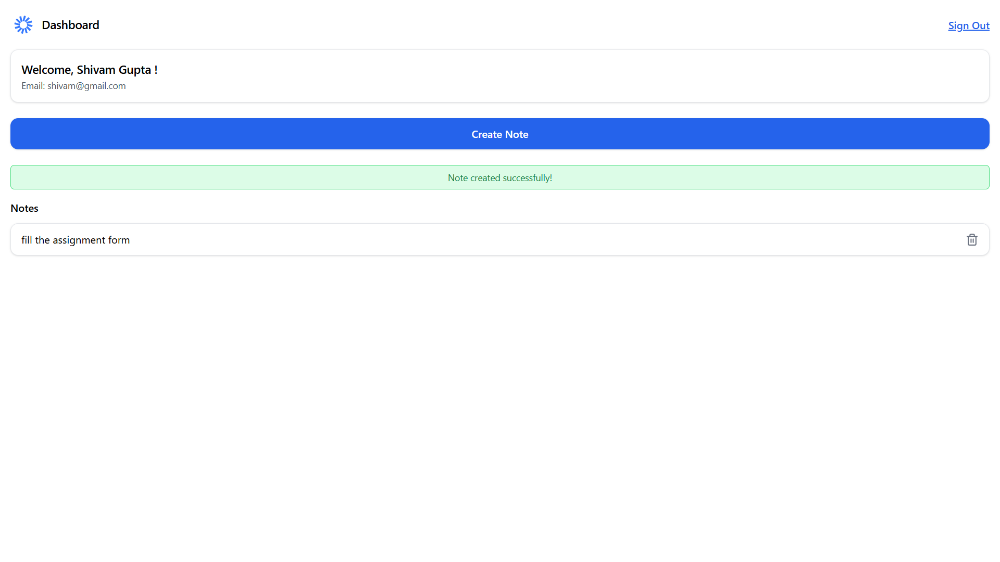

## MyNotez 📝

A full-stack **note-taking application** with modern authentication and a responsive design.
MyNotez allows users to securely sign up, log in (via email + OTP or Google), and manage personal notes (create & delete).

This project was built as part of an assignment to demonstrate full-stack development with **React + Node.js + TypeScript**.

---

## 🚀 Features

* **User Authentication**

  * Signup using **email + OTP** or **Google account**.
  * Proper input validation with error handling for invalid inputs, OTP errors, and API failures.
  * Secure authentication using **JWT**.
* **Notes Management**

  * Create and delete personal notes.
  * Display notes on a responsive dashboard.
* **User Experience**

  * Welcome page showing user details after login/signup.
  * Mobile-friendly, closely replicating the provided design.

---

## 🖼️ Screenshots


### Signup Page


### Dashboard



---

## 🛠️ Tech Stack

* **Frontend:** React.js (TypeScript)
* **Backend:** Node.js + Express (TypeScript)
* **Database:** MongoDB 
* **Authentication:** JWT, Google OAuth
* **Version Control:** Git & GitHub

---

## 📂 Project Structure

```
MyNotez/
│── backend/          # Node.js + Express server (API + Auth + Notes logic)
│── frontend/         # React + TypeScript client
│── screenshots/      # Screenshots for README (signup, dashboard, etc.)
│── .gitignore
│── README.md
```

---

## ⚙️ Setup & Installation

### 1. Clone the repository

```bash
git clone https://github.com/your-username/MyNotez.git
cd MyNotez
```

### 2. Setup environment variables

* Copy `.env.example` → `.env` in both **backend** and **frontend** folders.
* Add required keys:

  * Database connection string (MongoDB / MySQL / PostgreSQL)
  * JWT secret
  * Google OAuth client ID & secret

### 3. Install dependencies

```bash
# Install frontend dependencies
cd frontend
npm install

# Install backend dependencies
cd ../backend
npm install
```

### 4. Run the project locally

```bash
# Start backend (port 5000 by default)
cd backend
npm run dev

# Start frontend (port 3000 by default)
cd ../frontend
npm start
```

The app will be available at:
👉 [http://localhost:3000](http://localhost:3000)

---

## 📜 Scripts

### Frontend

* `npm start` – Run the development server.
* `npm run build` – Build the production-ready app.

### Backend

* `npm run dev` – Run backend in development mode with hot reload.
* `npm run build` – Compile TypeScript to JavaScript.
* `npm start` – Run the compiled backend server.

---

## 🚀 Deployment

The project is deployed here:
🔗 **[Live Demo](https://my-notez-9qj52kyqp-shivam-guptas-projects-49a15ad6.vercel.app/)**

---

## ✅ Additional Notes

* Code is written using the **latest stable versions** of dependencies.
* Each feature has been committed separately for better tracking.
* Cloud deployment ensures accessibility and easy testing.

---

## 👩‍💻 Author

Developed by **Shivam Gupta**
